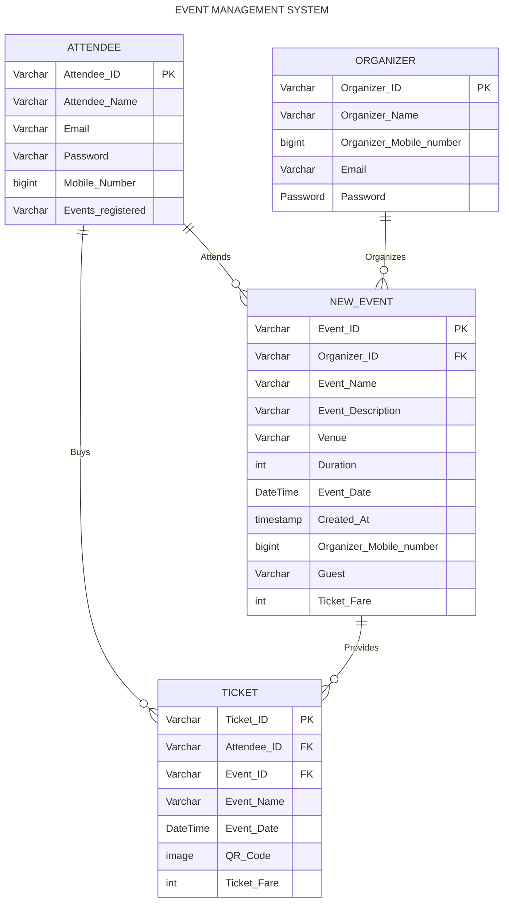

## ER Diagram

```mermaid

---
title: EVENT MANAGEMENT SYSTEM
---

erDiagram
    NEW_EVENT 
    TICKET 
    ATTENDEE ||--o{ NEW_EVENT : Attends
    ATTENDEE ||--o{ TICKET : Buys
    ORGANIZER ||--o{NEW_EVENT : Organizes
    NEW_EVENT ||--o{TICKET : Provides


    NEW_EVENT{
        Varchar Event_ID PK
        Varchar Organizer_ID FK
        Varchar Event_Name
        Varchar Event_Description
        Varchar Venue
        int Duration
        DateTime Event_Date
        timestamp Created_At
        bigint Organizer_Mobile_number
        Varchar Guest
        int Ticket_Fare
    }

    ATTENDEE{
        Varchar Attendee_ID PK
        Varchar Attendee_Name
        Varchar Email
        Varchar Password
        bigint Mobile_Number
        Varchar Events_registered
    }

    ORGANIZER{
        Varchar Organizer_ID PK
        Varchar Organizer_Name
        bigint Organizer_Mobile_number
        Varchar Email
        Password Password
    }

    TICKET{
        Varchar Ticket_ID PK
        Varchar Attendee_ID FK
        Varchar Event_ID FK
        Varchar Event_Name 
        DateTime Event_Date 
        image QR_Code
        int Ticket_Fare
    }


```
